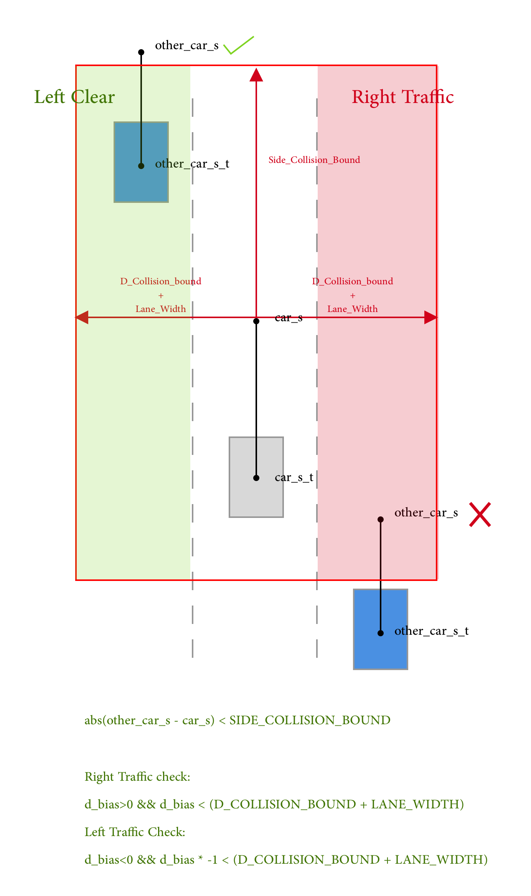
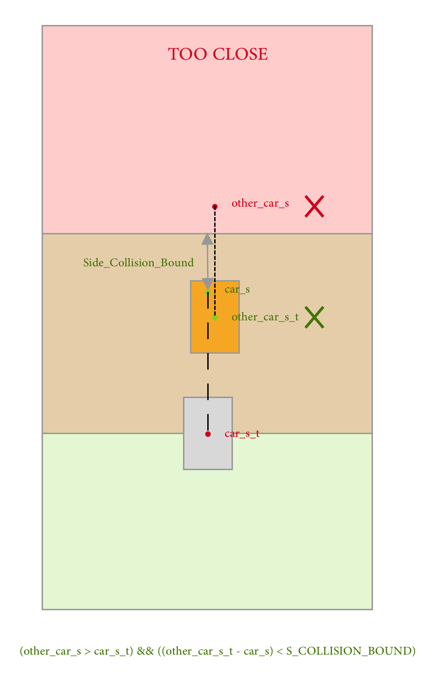

# Path Planning and Behavior Planning
This is a project from Self-Driving Car Engineer Nanodegree Program of Udacity. In this project, Udacity provided the simulator as well as the part of sensor fusion. So my task is to use these data to predict other cars behavior and do a path planning for the car to follow. This project did not consider car dynamics since that might not be a strict limitation in this high way cruising scenario.


   
### Simulator.
You can download the Term3 Simulator which contains the Path Planning Project from the [releases tab (https://github.com/udacity/self-driving-car-sim/releases/tag/T3_v1.2).  

To run the simulator on Mac/Linux, first make the binary file executable with the following command:
```shell
sudo chmod u+x {simulator_file_name}
```

I can not run the official version and used this one after all: https://github.com/jinay1991/motion_planning/releases/download/v1.1/term3_sim_mac_catalina.zip. This binary version was built by other Udacity students and can be run on macOS Catalina.

### Goals
In this project my goal is to safely navigate around a virtual highway with other traffic that is driving +-10 MPH of the 50 MPH speed limit. I was provided the car's localization and sensor fusion data, there is also a sparse map list of waypoints around the highway. The car should try to go as close as possible to the 50 MPH speed limit, which means passing slower traffic when possible, note that other cars will try to change lanes too. The car should avoid hitting other cars at all cost as well as driving inside of the marked road lanes at all times, unless going from one lane to another. The car should be able to make one complete loop around the 6946m highway. Since the car is trying to go 50 MPH, it should take a little over 5 minutes to complete 1 loop. Also the car should not experience total acceleration over 10 m/s^2 and jerk that is greater than 10 m/s^3 (the jerk is defined as the value of the third derivative of the car position). 

#### The map of the highway is in data/highway_map.txt
Each waypoint in the list contains  [x,y,s,dx,dy] values. x and y are the waypoint's map coordinate position, the s value is the distance along the road to get to that waypoint in meters, the dx and dy values define the unit normal vector pointing outward of the highway loop.

The highway's waypoints loop around so the frenet s value, distance along the road, goes from 0 to 6945.554.

## Model Documentation

### How to generate the path

As introduced in the guild video, I create a points set with 5 points in it. These points are: 

- Previous Position of the car: derived by using current angle
- Current Position of the car
- 30 meters ahead of the target lane
- 60 meters ahead of the target lane
- 90 meters ahead of the target lane

The target lane is usually the current lane of the car. While the car is changing the lane, the target lane is the new lane.

These guild points are feed into the spline model and will generate a smooth path (line) guided by these points. The line will be break up with equal distance into 30 points. These points are filled up to the path and combine a path with 50 points in it.

### How to give proper behavior /Users/sunciao/Documents/Self-Driving/CarND-Path-Planning-Project-master/Path-Planning-and-Behavior-Planning/Logic1.png

/Users/sunciao/Documents/Self-Driving/CarND-Path-Planning-Project-master/Path-Planning-and-Behavior-Planning/Logic2.png
/Users/sunciao/Documents/Self-Driving/CarND-Path-Planning-Project-master/Path-Planning-and-Behavior-Planning/Logic1.png


As shown in the graph, there are two logic checking here, lateral checking and longitudinal checking. 



Firstly, as shown in the graph, I am doing lateral checking to see whether the left and right of the car is clear. This state will be used later for lane changing behavior control. I am using the prediction position of our car and other cars to make the decision. The code is from line 147 to 161 in the main.cpp file.



Secondly, as shown in the graph, I am doing longitudinal check to see whether there is a car in front of us. This state will be used later for speed control. I am using the current position of the car to filter the cars behind us and using the predicted position with the current position of the other cars to do distance checking. This is considering the car in front might break hard at any time. So we used the current position instead of the predicted future position of the other cars.

Finally, if there is a car in front of us, I checked if left or right side of our car is clear. If any side is clear, then make a lane change. Otherwise, I make the car to slow down. In the end, the car will make a lane changing as soon as there is space in the other lanes. 

## Basic Build Instructions

1. Clone this repo.
2. Make a build directory: `mkdir build && cd build`
3. Compile: `cmake .. && make`
4. Run it: `./path_planning`.

Here is the data provided from the Simulator to the C++ Program

#### Main car's localization Data (No Noise)

["x"] The car's x position in map coordinates

["y"] The car's y position in map coordinates

["s"] The car's s position in frenet coordinates

["d"] The car's d position in frenet coordinates

["yaw"] The car's yaw angle in the map

["speed"] The car's speed in MPH

#### Previous path data given to the Planner

//Note: Return the previous list but with processed points removed, can be a nice tool to show how far along
the path has processed since last time. 

["previous_path_x"] The previous list of x points previously given to the simulator

["previous_path_y"] The previous list of y points previously given to the simulator

#### Previous path's end s and d values 

["end_path_s"] The previous list's last point's frenet s value

["end_path_d"] The previous list's last point's frenet d value

#### Sensor Fusion Data, a list of all other car's attributes on the same side of the road. (No Noise)

["sensor_fusion"] A 2d vector of cars and then that car's [car's unique ID, car's x position in map coordinates, car's y position in map coordinates, car's x velocity in m/s, car's y velocity in m/s, car's s position in frenet coordinates, car's d position in frenet coordinates. 

## Details

1. The car uses a perfect controller and will visit every (x,y) point it recieves in the list every .02 seconds. The units for the (x,y) points are in meters and the spacing of the points determines the speed of the car. The vector going from a point to the next point in the list dictates the angle of the car. Acceleration both in the tangential and normal directions is measured along with the jerk, the rate of change of total Acceleration. The (x,y) point paths that the planner recieves should not have a total acceleration that goes over 10 m/s^2, also the jerk should not go over 50 m/s^3. (NOTE: As this is BETA, these requirements might change. Also currently jerk is over a .02 second interval, it would probably be better to average total acceleration over 1 second and measure jerk from that.

2. There will be some latency between the simulator running and the path planner returning a path, with optimized code usually its not very long maybe just 1-3 time steps. During this delay the simulator will continue using points that it was last given, because of this its a good idea to store the last points you have used so you can have a smooth transition. previous_path_x, and previous_path_y can be helpful for this transition since they show the last points given to the simulator controller with the processed points already removed. You would either return a path that extends this previous path or make sure to create a new path that has a smooth transition with this last path.

## Smooth trajectories

A really helpful resource for doing this project and creating smooth trajectories was using http://kluge.in-chemnitz.de/opensource/spline/, the spline function is in a single hearder file is really easy to use.

---

## Dependencies

* cmake >= 3.5
  * All OSes: [click here for installation instructions](https://cmake.org/install/)
* make >= 4.1
  * Linux: make is installed by default on most Linux distros
  * Mac: [install Xcode command line tools to get make](https://developer.apple.com/xcode/features/)
  * Windows: [Click here for installation instructions](http://gnuwin32.sourceforge.net/packages/make.htm)
* gcc/g++ >= 5.4
  * Linux: gcc / g++ is installed by default on most Linux distros
  * Mac: same deal as make - [install Xcode command line tools]((https://developer.apple.com/xcode/features/)
  * Windows: recommend using [MinGW](http://www.mingw.org/)
* [uWebSockets](https://github.com/uWebSockets/uWebSockets)
  * Run either `install-mac.sh` or `install-ubuntu.sh`.
  * If you install from source, checkout to commit `e94b6e1`, i.e.
    ```
    git clone https://github.com/uWebSockets/uWebSockets 
    cd uWebSockets
    git checkout e94b6e1
    ```

## Editor Settings

We've purposefully kept editor configuration files out of this repo in order to
keep it as simple and environment agnostic as possible. However, we recommend
using the following settings:

* indent using spaces
* set tab width to 2 spaces (keeps the matrices in source code aligned)

## Code Style

Please (do your best to) stick to [Google's C++ style guide](https://google.github.io/styleguide/cppguide.html).


